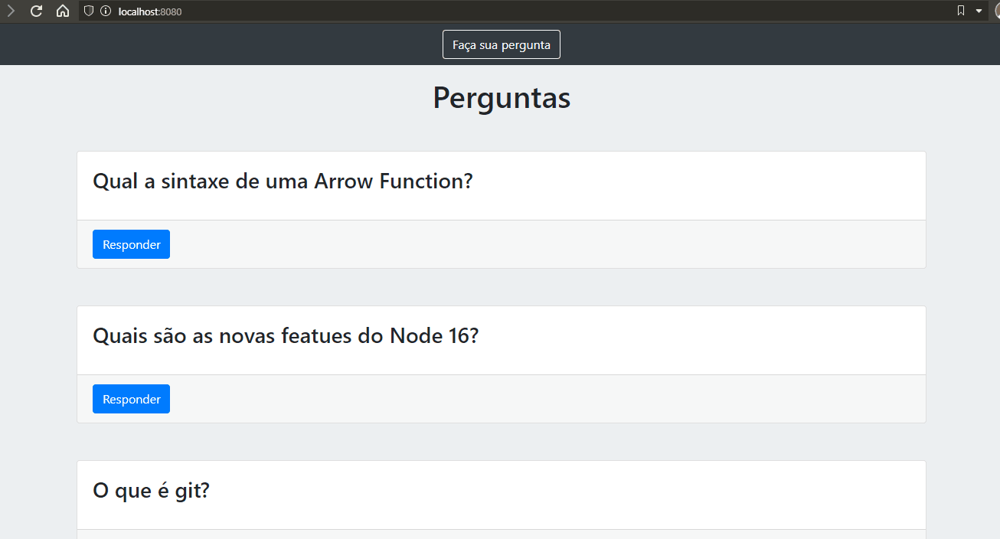

# Expert Questions



> Este projeto é baseado em um sistema de perguntas e respostas, baseado em sistemas do tipo brain.ly. Foi usado o Node.js no backend e no frontend foi usado o bootstrap.


## 📫 Tecnologias

- Node.js
- Express.js
- MySql
- Sequelize
- Bootstrap

## :construction_worker: Rodar Localmente

```
$ git clone https://github.com/higorsantana-omega/Plataforma_Duvidas.git
$ cd Plataforma_Duvidas
$ yarn
$ yarn start
$ localhost:8080
```